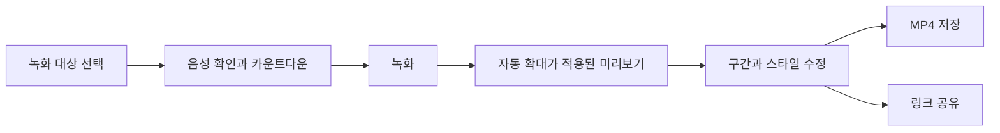

# 제품 기획과 사용자 경험

2026-09-10 · 검토용 초안

정식 출시 판정은 [Production Ready 기준](04-production-readiness.md)을 따릅니다. 기능 범위뿐 아니라 실제 완료율·데이터 보호·사용성·접근성을 검증해야 합니다. 첫 정식 버전의 검증 상한은 단일 소스 SDR 30분 녹화이며, 1080p30을 기본 지원하고 60fps는 인증 장비군에서 제공합니다.

## 제품 정의

Windows에서 제품 데모와 설명 영상을 만드는 사람에게, 녹화 직후 공유할 만한 결과물을 제공하는 프로그램입니다. 화면을 선택하고 설명하면, 중요한 조작이 잘 보이도록 확대 구간과 커서 움직임을 정리합니다. 사용자는 시작·끝과 강조 위치를 조금만 수정합니다.

기획 가설은 **“영상 편집을 배우지 않아도 1~5분짜리 서비스 소개 영상을 완성하고 싶다”**입니다. 자동 효과의 개수보다 첫 결과물의 전달력과 수정의 쉬움을 우선합니다.

| 사용자 | 자주 하는 일 | 성공한 경험 |
| --- | --- | --- |
| 1차: 기획자·디자이너·개발자 | 새 기능, 프로토타입, 작업 결과 설명 | 작은 버튼과 동선이 잘 보이는 데모를 빠르게 공유 |
| 2차: 고객 지원·교육 담당자 | 사용법과 문제 해결 방법 안내 | 조작 위치와 음성이 일치하는 짧은 안내 영상 |
| 확장: 강사·콘텐츠 제작자 | 긴 강의, 웹캠 포함 영상 | 장시간 안정성과 더 많은 편집 기능이 필요하므로 이후 검증 |

주 사용 상황은 웹·데스크톱 서비스 시연입니다. 2026-09-11 합의로 제품을 **녹화 모드 / 프레젠테이션 모드**로 나눕니다. 발표 모드는 별도 청중 창의 실시간 확대·추적과 기본 OFF인 선택적 녹화를 제공합니다. 상세 흐름과 현재 구현 범위는 [두 모드 UI·UX](06-two-mode-implementation.md)를 따릅니다.

## 제품 원칙

1. **처음부터 결과를 보여줍니다.** 녹화 종료 후 자동 확대가 적용된 미리보기를 엽니다.
2. **원본을 보존합니다.** 확대, 배경, 커서, 잘라내기는 다시 바꿀 수 있습니다.
3. **시선이 편안해야 합니다.** 중요한 행동을 강조하고, 작은 마우스 움직임마다 화면을 움직이지 않습니다.
4. **기본값으로 시작합니다.** 코덱·비트레이트는 고급 설정으로 감추고, 기본 내보내기는 MP4 1080p로 제안합니다.
5. **녹화를 신뢰할 수 있어야 합니다.** 녹화 상태, 마이크 입력, 저장 실패를 명확히 표시합니다.
6. **내 PC에서 먼저 완성합니다.** 계정 없이 녹화·편집·저장이 가능하고, 링크 공유 시에만 업로드합니다.

## 핵심 사용자 흐름

| 단계 | 화면에 보이는 것 | 핵심 조작과 결과 |
| --- | --- | --- |
| 시작 | 최근 프로젝트, 큰 ‘새 녹화’, 작은 ‘화면 캡처’ | 회원가입 없이 바로 시작 |
| 녹화 준비 | 화면·창·영역 선택, 마이크, 시스템 소리, 입력 미터 | 실제 대상과 소리 상태 확인. 이전 설정은 재사용 |
| 카운트다운 | 선택 영역과 3·2·1, 취소 | 대상이 닫히면 시작하지 않고 다시 선택 |
| 녹화 중 | 작은 컨트롤 바: 시간·일시정지·종료 | 편집기는 숨기고, 단축키·트레이로도 종료 가능 |
| 편집 | 큰 미리보기, 짧은 타임라인, 선택한 항목의 속성 | 재생하면서 자동 확대를 켜고 끄고 비교 |
| 저장·공유 | 파일 저장 / 링크 공유, 품질, 예상 크기, 진행률 | 완료된 파일 또는 재생 가능한 링크를 제공 |

스크린샷은 같은 대상 선택기를 사용합니다. 선택 → 정지 이미지 확인 → 배경·여백 → PNG 저장 또는 이미지 복사로 끝냅니다. 영상 편집 타임라인을 거치지 않습니다.

## 첫 출시 범위

내부 MVP와 공개 첫 버전을 구분합니다. 내부 MVP는 녹화와 자동 편집 가치 검증용이며, 공개 첫 버전은 사용자가 요청한 캡처·녹화·공유를 모두 다룹니다.

| 기능 | 내부 MVP | 공개 첫 버전 | 후속 확장 |
| --- | --- | --- | --- |
| 화면·창 녹화 | 포함 | 포함 | 다중 소스 합성 |
| 영역 녹화 | 단일 모니터에서 포함 | 포함 | 여러 모니터에 걸친 영역 |
| 마이크·시스템 소리 | 포함, 각각 켜고 끄기 | 포함, 음량 조절 | 특정 앱 소리, 노이즈 제거 |
| 커서 별도 기록 | 위치·클릭·표준 모양 | 크기·평활화·클릭 강조 | 다양한 사용자 커서·키 입력 표시 |
| 자동 확대 | 클릭 중심 규칙과 수동 수정 | 포함, 과한 확대 억제 | 의미 기반 강조 추천 |
| 구간 편집 | 시작·끝 자르기 | 중간 구간 삭제·실행 취소 | 속도 조절·멀티트랙 |
| 배경과 프레임 | 단색·그라데이션, 여백·모서리 | 프리셋 저장 | 브랜드 프리셋 공유 |
| 화면 비율 | 16:9 | 16:9·1:1·9:16, 수동 재구도 확인 | 세로 영상 구도 추천 개선 |
| 스크린샷 | PNG 저장·이미지 복사 | 포함 | 화살표·번호·블러 주석 |
| 영상 저장 | MP4, 1080p 30/60fps 목표 | 포함 | 검증된 장비에서 4K, GIF |
| 링크 공유 | 로컬 파일을 사용해 흐름 검증 | 업로드·취소·재시도·삭제·만료 | 비밀번호·팀 공간·댓글 |
| 프로젝트 | 자동 저장·다시 열기·복구 | 포함 | 팀 공동 편집 |
| 웹캠·자막 | 제외 | 사용자 검증 후 우선순위 재평가 | 웹캠 오버레이·자막·대본 |

초기 공식 지원 범위는 Windows 11 x64의 출시 시점 지원 중인 빌드로 제안합니다. 이는 제품 범위 결정이며 Windows 캡처 API의 최소 지원 버전과는 다릅니다. Windows 10·ARM64 수요는 인터뷰와 테스트 장비 확보 후 결정합니다.

## 편집 화면 설계

편집 화면은 한 장면에 집중합니다. 중앙 미리보기가 가장 크고, 하단에 영상·확대·오디오 트랙을 배치합니다. 오른쪽 속성 패널은 선택에 따라 ‘스타일 / 커서 / 확대 / 오디오’로 바뀝니다. 프로젝트 목록은 접을 수 있습니다.

| 위치 | 내용 | UX 결정 |
| --- | --- | --- |
| 상단 | 프로젝트명, 저장 상태, 새 녹화, 내보내기 | 주 작업 버튼은 한 위치 유지 |
| 중앙 | 편집 결과, 재생·일시정지, 원본 비교 | 비교는 누르고 있는 동안 원본 표시, 키보드에서도 가능 |
| 하단 | 실제 영상 길이, 구간 핸들, 확대 블록, 오디오 파형 | 자동 확대를 블록으로 보여 직접 길이·위치 수정 |
| 우측 | 선택한 효과의 속성 | 전문가용 전체 설정을 한꺼번에 노출하지 않음 |

확대 블록을 선택하면 미리보기에서 초점 위치를 드래그할 수 있습니다. 블록 삭제는 확대 효과만 제거합니다. 영상 삭제와 구분되는 메뉴 이름을 사용합니다. 자동 확대를 다시 생성해도 사용자가 잠근 블록은 유지합니다.

처음 실행할 때 짧은 샘플 프로젝트를 제공하고 ‘샘플’이라고 표시합니다. 실제 녹화를 시작하는 데 긴 튜토리얼이나 샘플 완료를 요구하지 않습니다.

## 모션 설계

UI 애니메이션과 결과 영상의 애니메이션은 별도로 조정합니다. UI는 조작의 반응을, 영상은 설명의 가독성을 높이는 역할입니다.

| 대상 | 초기 제안값 | 의도 |
| --- | --- | --- |
| 버튼·토글 반응 | 120~180ms | 즉시 반응하고 상태만 짧게 정리 |
| 패널 전환 | 180~240ms | 방향을 유지하고 과한 이동 억제 |
| 영상 확대·축소 | 450~800ms | 급격한 줌과 흔들림 억제 |
| 클릭 전 확대 시작 | 약 250ms 전부터 | 녹화 후 데이터로 중요한 조작을 미리 보여줌 |
| 기본 확대 배율 | 1.4~1.8배, 원본 해상도로 제한 | 글자를 읽기 쉽게 하면서 맥락 유지 |
| 확대 유지 | 약 1.2~3초 | 연속 동작을 묶고 빈번한 확대·축소 방지 |
| 커서 정지 후 숨김 | 선택 기능, 초기 기본 끔 | 설명 중 포인터가 갑자기 사라지는 문제 예방 |

수치는 사용자 테스트를 시작하기 위한 가설입니다. 자연스러움이 프레임률만으로 결정되는 것은 아니므로, 과도한 이동 거리·오버슈트·잦은 확대도 함께 평가합니다.

**커서는 정확하고, 카메라는 차분해야 합니다.** 커서는 클릭 순간 실제 위치와 맞아야 하고, 카메라는 커서가 안전 영역을 벗어날 때 이동합니다. 드래그·텍스트 선택에서는 평활화를 약하게 해 실제 동작과의 차이를 줄입니다. 장면 이동 중에는 확대를 풀어 다음 맥락을 보여줍니다.

OS의 애니메이션 감소 설정은 앱 UI에 반영합니다. 결과 영상에는 별도의 ‘움직임 적게’ 프리셋을 제공해 작은 확대, 느린 전환, 낮은 클릭 강조를 선택할 수 있게 합니다.

## 예외 상황의 사용자 경험

| 상황 | 대응 |
| --- | --- |
| 마이크 접근 거부·장치 없음 | 해당 원인을 보여주고 장치 재선택 또는 음성 없이 시작 |
| 창이 최소화되거나 캡처 프레임이 멈춤 | 상태 감지 후 일시정지 또는 경고. 정지 화면을 정상 녹화로 오인하게 하지 않음 |
| 대상 창 종료·모니터 분리 | 현재까지 저장하고 대상 변경 또는 종료 선택 |
| 디스크 부족 | 녹화 전 공간 추정, 녹화 중 감시, 쓰기 실패 전에 안전 종료 시도 |
| 녹화 중 앱 종료 | 녹화 종료·저장 후 닫기. 강제 종료는 다음 실행 때 복구 안내 |
| 자동 확대가 과함 | ‘확대 없음’ 한 번으로 비교하고 해당 블록 삭제 가능 |
| 원본에 커서가 이미 포함됨 | 중복 커서를 추가하지 않고 커서 교체 옵션 비활성화 |
| 업로드 실패·오프라인 | 완성된 로컬 파일 유지, 재시도·파일 위치 열기 |

키보드 탐색, 버튼 이름을 가진 접근성 정보, 색 이외의 녹화 상태 표시는 첫 버전 범위입니다. 전역 단축키는 충돌을 감지하고 변경할 수 있게 합니다. 임의의 전체 키 입력은 기록하지 않습니다.

## 공유 경험

내보내기 화면에서 ‘파일 저장’과 ‘링크 공유’를 명확하게 제시합니다. 파일 저장은 계정이 필요 없습니다. 링크 공유는 완성된 영상을 로컬에서 만든 뒤 업로드하며, 목적지와 공개 범위를 확인합니다.

초기 링크는 ‘링크를 가진 사람에게 공개’로 정의합니다. 기본 만료 기간은 7일을 제안하고, 만들기 전에 표시합니다. 소유자는 링크를 삭제할 수 있고 만료된 링크는 재생되지 않습니다. 비밀번호와 조직별 접근 제어는 별도 단계입니다.

업로드된 파일의 서버 검증이 끝나기 전에는 완료로 표시하지 않습니다. 공유 과정이 실패해도 녹화 원본과 편집 프로젝트는 유지합니다. 프로젝트 전체와 커서 이벤트는 기본 업로드 대상이 아닙니다.

## 검증할 가설

- 초보 사용자가 도움 없이 대상과 음성을 선택해 첫 녹화를 시작할 수 있는가?
- 자동 확대 결과를 보고 의미 있는 수정이 0~2회에 그치는가?
- 설명을 듣는 사람이 커서가 가리키는 버튼과 다음 단계를 따라갈 수 있는가?
- 파일 저장과 링크 공유 중 어느 쪽이 실제 업무에 더 자주 쓰이는가?
- 웹캠·자막이 없어도 구매 의향 또는 반복 사용 의향이 생기는가?

초기에는 1차 사용자 5~8명을 대상으로 동일한 60초 서비스 소개 과제를 관찰합니다. 이 규모의 결과를 전체 시장의 전환율로 해석하지 않습니다. 첫 녹화까지의 시간, 자동 확대 수정 횟수, 완성 여부, 불편한 장면과 그 이유를 수집합니다.

가격과 과금 단위는 아직 정하지 않습니다. 로컬 편집의 가치와 클라우드 저장·전송 비용을 분리해 검증한 뒤 구매 모델을 결정합니다.
