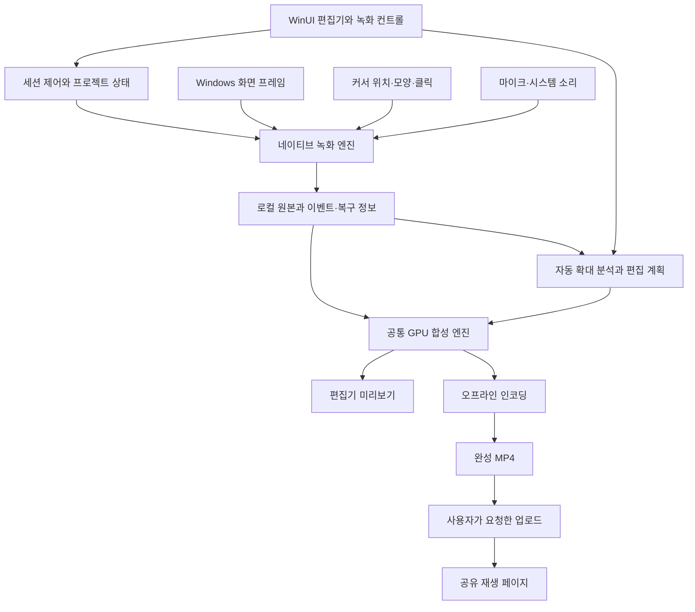
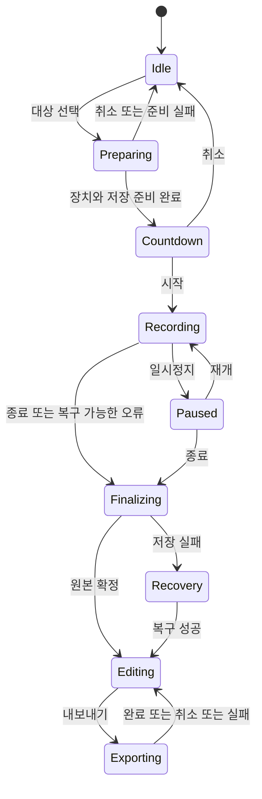

# 기술 설계

2026-09-10 · 제안 아키텍처 · 구현·성능 검증 전

구현 완료와 정식 출시 판정에는 [Production Ready 기준 v1.0](04-production-readiness.md)을 적용합니다. 이 문서의 기술 선택·탐색용 수치는 설계 제안이며, 실제 지원 범위·측정 허용 오차·복구 조건은 정식 출시 기준을 충족해야 합니다.

## 핵심 결정

**원본 영상, 음성, 커서·클릭 이벤트, 편집 설정을 분리하고 미리보기와 내보내기에 같은 합성 엔진을 사용합니다.** 확대된 영상만 녹화하면 이후 다른 배율·구도·커서 효과를 적용하기 어렵습니다.

사용자 PC의 실제 커서를 움직이거나 실제 바탕화면을 확대하지 않습니다. 녹화 모드에서는 녹화 후 가상 카메라를 적용하고, 프레젠테이션 모드에서는 별도 청중 창에 실시간 구도를 합성합니다. 화면 수집과 파일 저장 소비자를 분리해 저장 없는 발표를 지원합니다. 새 코드 경계와 ABI는 [두 모드 구현](06-two-mode-implementation.md)에 기록합니다.

## 기술 스택 제안

Windows 전용 제품이며 네이티브 미디어 개발자를 확보할 수 있다는 가정에서는 **C# / WinUI 3 + C++ / WinRT 엔진**을 1순위로 제안합니다. WinUI 3는 Windows App SDK의 네이티브 UI 프레임워크로 C#·C++를 지원합니다. 프레임워크 선택만으로 녹화 성능이 보장되지는 않습니다. [Microsoft WinUI 3](https://learn.microsoft.com/en-us/windows/apps/winui/winui3/)

| 계층 | 제안 | 선택 이유와 검증할 점 |
| --- | --- | --- |
| UI·프로젝트 상태 | C# / WinUI 3, MVVM | Windows 입력·접근성·창 동작 통합. 타임라인은 별도 성능 확인 |
| 화면 수집 | C++ / WinRT, Windows.Graphics.Capture | 창·모니터의 GPU 프레임 수집, 커서 제외 |
| 커서·마우스 | Win32 위치·모양 + Raw Input 우선 검증 | UI와 독립적으로 수집. 클릭·휠 이벤트 정확도 확인 |
| 오디오 | WASAPI 입력 및 루프백 | 마이크와 시스템 소리를 분리 저장 |
| 합성·미리보기 | Direct3D 11, WinUI 네이티브 렌더링 표면 | 프레임을 GPU에 유지하고 효과 합성 |
| 인코딩·디코딩 | Media Foundation, 하드웨어 MFT 우선 | 장치별 지원 확인, 소프트웨어 대체 경로 |
| 프로젝트 | 폴더 기반 미디어 + 버전 있는 JSON + 로컬 인덱스 | 큰 영상을 메모리나 DB 단일 값으로 저장하지 않음 |
| 공유 | 인증 API, 비공개 객체 저장소, 재생 페이지 | 로컬 편집과 독립적으로 추가·실패 복구 |

대안의 판단 기준은 팀의 역량입니다. 아래 비교는 제품 요구사항에 따른 설계 판단이며 실측 성능 비교가 아닙니다.

| 선택지 | 적합한 조건 | 이 제품에서의 부담 |
| --- | --- | --- |
| WinUI 3 + C++ 엔진 | Windows 집중, C#·C++ 역량 확보 | 미디어·XAML 경험 필요. 향후 macOS UI 재작성 |
| Tauri + 웹 UI + 네이티브 엔진 | React·Rust 역량이 강함 | GPU 미리보기 표면과 WebView 결합 검증 필요 |
| Electron + 웹 UI + 네이티브 엔진 | 웹 팀의 빠른 편집 UI 검증 | 배포·메모리 비용 실측 필요. 커서 분리와 합성은 별도 엔진 필요 |

Tauri는 Windows에서 WebView2와 코어 프로세스를 사용합니다. Electron도 데스크톱 캡처 API를 제공하지만, 내장 캡처만으로 이 문서의 모든 커서·효과 편집 요구가 해결된다고 가정하지 않습니다. 웹 기반 셸을 선택해도 프레임을 JSON·Base64 IPC로 전달하는 설계는 피합니다. [Tauri 프로세스 모델](https://v2.tauri.app/concept/process-model/), [Electron desktopCapturer](https://www.electronjs.org/docs/latest/api/desktop-capturer)

## 구성과 데이터 흐름



초기에는 한 앱 프로세스 안에서 UI·수집·오디오·디스크·렌더 스레드를 분리합니다. 엔진을 C++ DLL의 버전 있는 C ABI 또는 WinRT 컴포넌트로 노출하고 UI가 네이티브 객체 수명을 임의로 관리하지 않게 합니다. 오류는 상태·이벤트로 전달합니다.

별도 녹화 프로세스는 UI 장애 격리에 유리하지만 IPC·GPU 표면 공유 비용이 생깁니다. 첫 PoC부터 프로세스를 늘리지 않고 복구 저장을 먼저 검증합니다. 장시간 신뢰성에서 필요가 확인되면 엔진 호스트를 분리할 수 있도록 제어 인터페이스와 미디어 코어의 의존성을 제한합니다.

## 화면 수집

모니터·창은 Windows.Graphics.Capture를 기본 경로로 사용합니다. 창 캡처 항목은 Win32 상호운용을 통해 HWND로 만들 수 있습니다. 영역 녹화는 선택한 단일 모니터를 수집한 뒤 GPU에서 고정 영역을 잘라 저장합니다. 앱의 대상 선택 UI에서 사용자의 선택을 확인한 후 시작합니다. [CreateForWindow](https://learn.microsoft.com/en-us/windows/win32/api/windows.graphics.capture.interop/nf-windows-graphics-capture-interop-igraphicscaptureiteminterop-createforwindow)

`IsCursorCaptureEnabled = false`로 커서 없는 원본을 확보합니다. 이 속성은 Windows 10 2004에서 도입되었습니다. 앱이 콘텐츠 안에 직접 그리는 포인터까지 제거해 준다는 의미는 아닙니다. 소프트웨어 포인터가 포함된 대상은 이중 커서 여부를 검증하고 교체 효과를 제한합니다. [IsCursorCaptureEnabled](https://learn.microsoft.com/en-us/uwp/api/windows.graphics.capture.graphicscapturesession.iscursorcaptureenabled?view=winrt-26100)

수집 프레임은 즉시 소유한 제한 크기의 GPU 버퍼 풀로 넘기고 캡처 프레임을 해제합니다. 수집 콜백에서 압축·파일 쓰기·UI 갱신을 기다리지 않습니다. 생산 속도를 따라가지 못하면 영상 프레임을 제한적으로 건너뛰고 실제 타임스탬프를 보존합니다. 메모리 큐는 무제한 증가시키지 않습니다.

크기 변경 시 `ContentSize`와 실제 프레임을 기준으로 풀·크롭 변환을 갱신합니다. HDR은 초기 공개 범위에서 제외하거나 명시적으로 SDR 변환을 검증한 뒤 허용합니다. 단순 8비트 수집으로 색이 정상이라고 가정하지 않습니다. Microsoft는 HDR 수집 시 부동소수점 파이프라인과 필요에 따른 톤 매핑을 설명합니다. [Windows 화면 캡처 가이드](https://learn.microsoft.com/en-us/windows/apps/develop/media-authoring-processing/screen-capture)

## 커서·클릭·좌표

녹화 중에만 수집기를 활성화합니다. 위치·표시 여부·모양은 `GetCursorInfo` 계열을 사용하고 표준 커서는 별도 리소스에 매핑합니다. 사용자 정의 커서는 비트맵과 핫스팟을 저장하는 대체 경로를 마련합니다. 모양 핸들만 파일에 저장해서는 다음 실행 때 복원할 수 없습니다. [GetCursorInfo](https://learn.microsoft.com/en-us/windows/win32/api/winuser/nf-winuser-getcursorinfo)

마우스 버튼·휠 수집은 Raw Input을 먼저 검증합니다. 저수준 훅이 필요한 경우 전용 메시지 루프에서 이벤트만 큐로 넘기고 즉시 다음 훅을 호출합니다. 훅에서 이미지 처리·디스크 쓰기를 하지 않습니다. Microsoft는 훅 지연 시 제거될 수 있음을 설명하며 가능한 경우 Raw Input을 권장합니다. 관리자 창·원격 세션 등에서의 동작은 테스트 결과로 지원 범위를 정합니다. [LowLevelMouseProc](https://learn.microsoft.com/en-us/windows/win32/winmsg/lowlevelmouseproc)

위치는 목표 120Hz로 샘플링하되 실제 수집 간격도 기록합니다. 시간 순서가 동일한 중복 좌표는 압축할 수 있습니다. 이벤트에는 버튼, down/up, 휠 양, 커서 모양 변경을 기록하며 입력한 텍스트는 기록하지 않습니다.

좌표 변환은 다음 순서로 통일합니다.

1. 앱을 Per-Monitor DPI aware로 구성하고 원시 화면 좌표를 물리 픽셀 기준으로 변환합니다.
2. 시점별 캡처 경계·크기·회전·DPI를 `geometry` 이벤트로 기록합니다.
3. 대상 화면 원점과 크기로 캡처 내부 좌표를 계산하고 원본 프레임의 좌표계로 매핑합니다.
4. 편집 계산에는 정규화 좌표를 사용하고, 커서 핫스팟을 반영해 출력에 배치합니다.
5. 창 외부 또는 가림 상태 등 유효하지 않은 커서는 무조건 가장자리에 붙이지 말고 숨김·불확실 상태로 기록합니다.

`GetWindowRect`는 DPI 가상화와 보이지 않는 크기 조절 테두리를 포함할 수 있습니다. DWM의 프레임 경계도 캡처 픽셀과 항상 일치한다고 가정하지 않습니다. 창 종류별로 실제 WGC 표면과 비교하는 좌표 테스트가 필요합니다. [GetWindowRect 주의사항](https://learn.microsoft.com/en-us/windows/win32/api/winuser/nf-winuser-getwindowrect)

## 시간 동기화와 오디오

프로젝트 시간은 단일 QPC 기준으로 정규화합니다. Windows 캡처 프레임의 `SystemRelativeTime`은 QPC 기반 시간입니다. 마우스 이벤트의 수신 시각은 입력 발생 시각과 다를 수 있으므로 수신 지연을 측정합니다. 오디오는 장치 위치·클록 정보를 같은 기준에 대응시킵니다. [화면 프레임과 시간 정보](https://learn.microsoft.com/en-us/windows/apps/develop/media-authoring-processing/screen-capture)

마이크 입력과 시스템 소리는 별도 트랙으로 기록합니다. 시스템 소리는 WASAPI shared-mode loopback으로 선택된 출력 장치의 믹스를 수집합니다. 녹화 앱에서 마이크를 스피커로 재생하는 기능은 기본 끔으로 해 에코를 예방합니다. [WASAPI Loopback Recording](https://learn.microsoft.com/en-us/windows/win32/coreaudio/loopback-recording)

내부 믹싱은 48kHz float를 제안합니다. 장치의 원래 샘플률을 확인해 리샘플링하고 무음 구간도 타임라인 길이를 유지합니다. 마이크·시스템 클록의 장기 드리프트는 오디오를 기준 시간에 맞춰 보정합니다. 일시정지 구간은 영상·음성·이벤트 모두 동일한 시간 매핑에서 제외합니다.

특정 앱의 소리만 녹음하는 기능은 후속 단계입니다. Microsoft의 프로세스 루프백 예제는 대상 프로세스 트리를 지정하는 별도 경로를 제시하며 빌드 조건이 있습니다. 일반 루프백에 PID 옵션을 넣는 것만으로 해결된다고 보지 않습니다. [Application Loopback 공식 예제](https://github.com/microsoft/Windows-classic-samples/blob/main/Samples/ApplicationLoopback/README.md)

## 자동 확대와 커서 평활화

첫 버전은 설명 가능한 규칙 기반 분석으로 시작합니다. AI 모델과 화면 내용의 서버 전송은 필요하지 않습니다. 녹화 후 전체 동선을 알 수 있다는 이점을 사용합니다.

분석 절차는 다음과 같습니다.

1. 클릭·더블클릭·머무름을 확대 후보로 만듭니다. 단순 이동은 약한 신호입니다.
2. 약 1초 안의 가까운 클릭을 한 행동으로 묶습니다. 드래그는 down부터 up까지 별도 구간입니다.
3. 후보 이전 약 250ms에 확대를 시작하고 마지막 중요 행동 이후 잠시 유지합니다.
4. 대상 주변의 안전 영역을 잡고 커서가 벗어날 때만 카메라를 이동합니다. 중요 조작을 가장자리에서 잘라내지 않습니다.
5. 후보가 겹치면 합치거나 우선순위를 선택합니다. 중첩 확대를 곱해서 배율이 폭증하지 않게 합니다.
6. 해상도·화면 비율을 고려해 배율을 제한합니다. 사용자가 만든 수동 구간은 자동 구간보다 우선합니다.
7. 최종 확대 구간과 결정 이유를 저장합니다. 알고리즘 버전 변경이 기존 프로젝트의 결과를 몰래 바꾸지 않게 합니다.

초기 평활화는 이동 구간의 노이즈를 줄인 뒤 시간에 따라 보간하는 방식입니다. 클릭 시각·좌표는 고정점으로 보존하고 드래그에서는 보정을 줄입니다. 클릭 당시의 UI hover·tooltip과 합성 커서가 어긋나지 않는지도 검사합니다. 전체 동선에 큰 지연을 주는 필터를 적용하지 않습니다.

카메라는 감쇠가 충분한 스프링 또는 속도 변화가 완만한 보간으로 움직입니다. 스프링을 사용하면 고정 시간 간격으로 경로를 사전 계산합니다. 재생 프레임률·스크럽 순서에 따라 결과가 달라지는 실시간 상태 의존 계산은 피합니다.

출력 비율이 바뀌면 확대 구간의 안전 영역을 다시 계산합니다. 가로 영상의 확대 배율과 중심점을 세로 영상에 그대로 재사용하지 않습니다. ‘움직임 적게’ 프리셋은 후보 수, 이동 거리, 배율을 함께 낮춥니다.

## 해상도와 렌더링

기본 목표 출력은 1080p 60fps이며 장치 성능에 따라 30fps를 선택할 수 있게 합니다. 캡처 프레임률과 출력 프레임률은 별개입니다. 낮은 원본 프레임률을 60fps 컨테이너로 저장했다고 원본 동작이 더 부드러워졌다고 표시하지 않습니다.

글자 선명도를 위해 가능하면 원본 해상도를 보존합니다. 예를 들어 3840×2160 원본을 2배 확대하면 약 1920×1080 영역이 남지만, 1920×1080 원본을 2배 확대하면 약 960×540 영역을 확대하는 셈입니다. 배경 여백·출력 비율까지 고려해 ‘선명도 우선’ 배율 상한을 계산합니다. 모든 장치에 4K 60fps 캡처를 기본으로 강제하지 않습니다.

합성 순서는 배경 → 크롭·카메라 변환한 영상 → 커서·클릭 효과 → 프레임·장식입니다. 모서리 클리핑과 그림자를 일관된 출력 좌표에서 처리합니다. UI용 그림자·CSS와 별도의 영상 효과를 혼용하지 않습니다.

미리보기와 내보내기는 동일한 `Render(projectRevision, outputTime, outputSize)` 계획을 사용합니다. 미리보기만 해상도를 낮출 수 있고 효과 계산은 동일합니다. 내보내기는 벽시계 재생을 화면에서 다시 녹화하지 않고 출력 시각 n/fps마다 정확히 샘플링해 인코더로 보냅니다.

인코더 입력은 지원되는 NV12 등으로 변환하고 H.264/AAC MP4를 기본으로 제안합니다. Media Foundation의 하드웨어 변환을 명시적으로 활성화·탐색하고 실제 선택된 인코더와 처리 속도를 진단합니다. 장치가 지원하지 않으면 해상도·fps 조정 또는 소프트웨어 경로를 제공합니다. [H.264 인코더](https://learn.microsoft.com/en-us/windows/win32/medfound/h-264-video-encoder), [하드웨어 변환 활성화](https://learn.microsoft.com/en-us/windows/win32/medfound/mf-readwrite-enable-hardware-transforms)

## 저장·편집·복구

프로젝트는 다음과 같은 폴더 구조를 제안합니다. 실제 포맷은 복구 PoC 후 확정합니다.

```text
project-id/
  project.json          # 버전, 소스 정보, 편집 revision, 시간 매핑
  media/
    screen-0001.mp4      # 확정된 짧은 원본 세그먼트
    screen-0002.mp4
    mic-0001.wav         # 분리된 음성 세그먼트
    system-0001.wav
  events/
    cursor.bin          # 시간, 위치, 유효 여부, 모양 ID
    mouse.bin           # 클릭·드래그·휠
    geometry.jsonl      # 시점별 좌표 변환
  cursors/              # 복원 가능한 커서 이미지와 핫스팟
  edits.json            # 남길 구간, 확대, 스타일, 오디오 설정
  journal.jsonl         # 확정된 세그먼트와 복구 상태
  cache/                # 삭제해도 다시 만들 수 있는 프록시·썸네일
```

원본은 무압축 RGB 덩어리 대신 고품질 압축 영상을 디스크로 스트리밍합니다. 압축 설정·GOP 길이는 빠른 탐색, 글자 선명도, 저장 용량을 함께 측정해 정합니다.

처음에는 약 5초 단위로 독립 재생 가능한 미디어 세그먼트를 확정하는 방식을 검증합니다. 각 세그먼트는 키프레임과 필요한 초기화 정보를 포함해야 합니다. 단일 MP4의 마지막 인덱스 기록에만 의존하지 않습니다. 현재 쓰는 세그먼트가 손상되어도 이전에 확정된 세그먼트를 다시 열 수 있어야 합니다.

프로젝트 설정은 임시 파일 쓰기 후 원자적 교체를 사용하고, 확정 기록과 미디어 상태가 일치하는지 복구 시 검증합니다. 강제 종료·디스크 쓰기 실패·저장 장치 분리에 대한 손실 범위는 실측합니다. 5초 분할만으로 정전 손실이 5초 이내라고 보장하지 않습니다.

트림과 중간 구간 삭제는 원본을 수정하지 않고 남길 원본 시간 구간을 저장합니다. 영상·음성·커서·확대 구간 모두 같은 편집 시간 매핑을 사용합니다. 실행 취소는 편집 명령 또는 revision으로 관리하고 내보내기는 시작 시점 revision을 고정합니다.

## 상태와 제어 계약



공유 업로드는 확정된 내보내기 파일에 연결된 별도 작업 상태로 관리합니다. 편집 프로젝트를 닫거나 업로드를 취소해도 이미 저장된 파일은 유지합니다.

명령 예시는 `PrepareCapture`, `Start`, `Pause`, `Resume`, `Stop`, `OpenProject`, `ApplyEdit`, `Export`, `CancelExport`입니다. 중복 Stop은 동일한 결과를 반환하고 Preparing 중 대상이 사라지면 시작하지 않습니다. 상태마다 허용되는 명령을 검증하며 취소 시 장치·파일·GPU 리소스를 해제합니다.

## 공유 서비스

공개 첫 버전에는 최소 공유 서버가 필요합니다. 구체적인 클라우드 사업자는 아직 선택하지 않습니다.

1. 사용자가 ‘링크 공유’를 선택하면 로컬에서 최종 MP4를 만듭니다.
2. 인증된 소유자가 업로드 작업을 만들고, 제한된 수명·크기의 업로드 권한을 받습니다.
3. 앱은 객체 저장소에 업로드합니다. 중단 지점 재시도 또는 멀티파트 전략을 사용합니다.
4. 서버가 업로드 완료·크기·미디어 형식을 검증한 뒤 공유 상태를 ready로 바꿉니다.
5. 재생 페이지는 유효한 공유 토큰을 확인하고 짧은 수명의 미디어 접근 권한을 발급합니다.
6. 삭제·만료는 이후의 미디어 접근을 막고 저장 객체 정리 작업으로 연결합니다. 이미 다운로드한 복사본은 회수할 수 없습니다.

저장소 버킷은 기본 비공개입니다. 공개 링크에 원본 저장소의 영구 공개 URL을 노출하지 않습니다. 원본 프로젝트·입력 이벤트·임시 파일은 업로드하지 않습니다. 진단 로그에도 창 제목·입력 내용·커서 동선은 기본 제외합니다.

초기에는 변환된 MP4의 Range 요청과 빠른 재생 시작을 지원합니다. 장시간·대규모 재생 수요가 확인되면 적응형 스트리밍과 추가 트랜스코딩을 검토합니다. 인증·업로드 한도·저장 기간·삭제·비용 제한은 공개 전에 함께 구현합니다.

## 검증 전인 결정

- 팀이 웹 기술 중심이면 UI 스택 선택을 재검토합니다. 커서 없는 원본과 공통 렌더러라는 원칙은 유지합니다.
- GPU 미리보기 표면, 하드웨어 인코더 조합, 커서 모양 수집 범위는 실제 Windows 장비에서 PoC가 필요합니다.
- HDR·보호된 콘텐츠·보안 데스크톱·원격 세션·특수 전체화면 앱은 기본 지원으로 약속하지 않습니다.
- 목표 성능, 분할 저장 주기, 확대·평활화 파라미터는 측정과 사용자 관찰 후 확정합니다.

공식 API 문서는 구현 가능성의 근거입니다. 위 설계가 이미 구현되었거나 특정 하드웨어에서 성능이 입증되었다는 뜻은 아닙니다.
